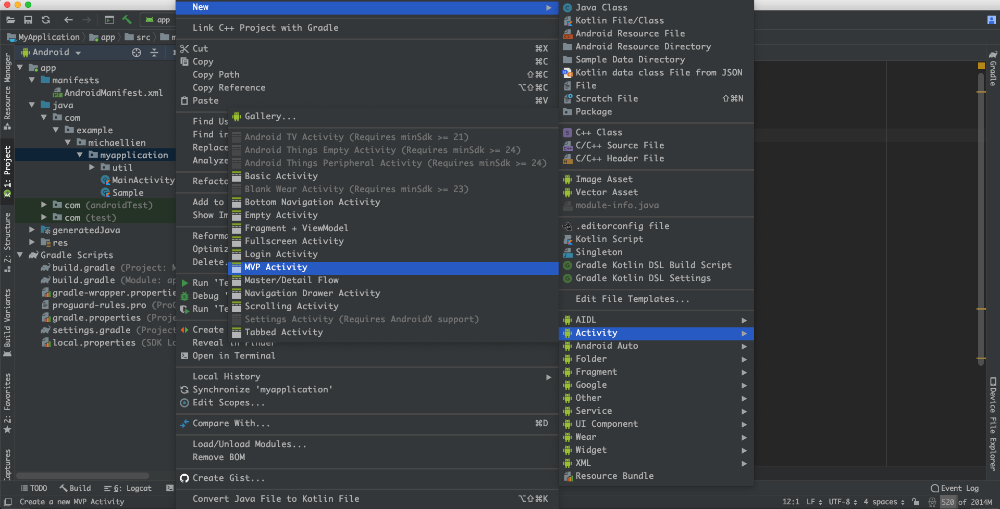

# MVPTemplate
A MVP Activity template for Android Studio



and the hierarchy:

```
com.company.app
    +-- (whatever directory)
    |   - MainActivity
    |   - MainContract
    |   - MainPresenter
```    

#### For MacOS:

run the install script at the root of this repository:

```
./install.sh
```

if you had installed `zsh`, please run below command first:

```
chmod +x install.sh
```

* Manual installation:

Just copy the directory `MVPActivity` to `$ANDROID_STUDIO_FOLDER$/Contents/plugins/android/lib/templates/activities/`

#### For Windows:

Just copy the directory `MVPActivity` to `$ANDROID_STUDIO_FOLDER$\plugins\android\lib\templates\activities\`


